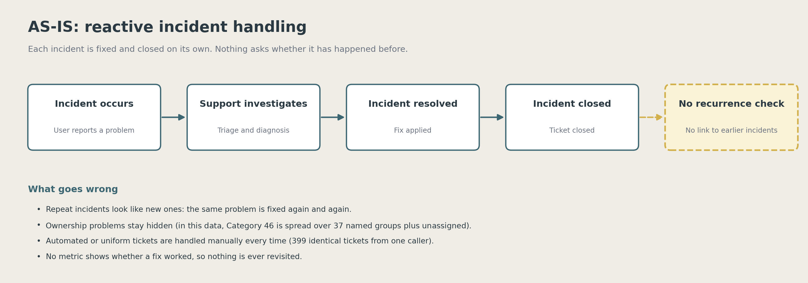
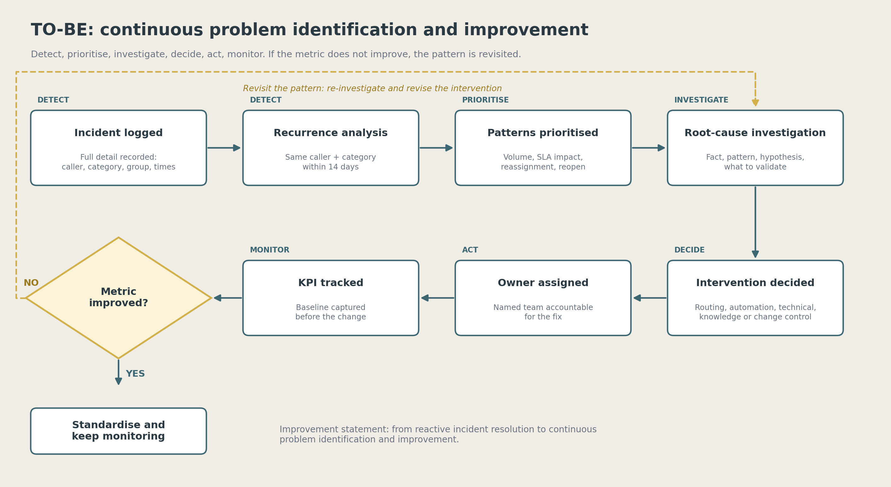

# IT Operations Intelligence & Incident Problem Management Analytics

**From closing tickets to fixing causes.** A SQL, Python and Power BI project that turns a real ServiceNow incident log into a short list of recurring operational problems, each with an evidence chain, an intervention type, a proposed owner and a metric that would show whether the fix worked.

| | |
|---|---|
| **Data** | Real, anonymised ServiceNow incident event log: 119,998 event rows, **20,769 incidents** |
| **Tools** | MySQL 8, Python (pandas, NumPy), Power BI |
| **Framework** | Detect, Prioritise, Investigate, Decide, Act, Monitor |
| **Output** | 3-page dashboard, executive brief, end-to-end case study, analytical appendix, AS-IS / TO-BE process |
| **Author** | Priyanka Karyampudi |

> The dashboard itself (`.pbix`) is not previewed here as images — see [`dashboard/README.md`](dashboard/README.md) for a full page-by-page description of what it shows and how it was built.

## The problem

Most IT teams fix an incident and close it. Nobody asks whether the same problem has happened before, whether it belongs to a team, or whether a fix worked. Without a record of incidents there is no way to tell a new issue from one that keeps coming back. This project shows what becomes possible once incidents are recorded and analysed: the organisation can move from reactive resolution to continuous problem identification and improvement.

**Where this comes from.** This project started with a question I couldn't answer during an internship at Protiviti: if incidents are only handled verbally, with nothing recorded, how would you ever know if the same one kept coming back? This project is my attempt to answer that, using a separate, real, anonymised, publicly available ServiceNow dataset, not client data. Full story: `02_End_to_End_Case_Study.pdf`, section 2, or `documentation/Analysis_Walkthrough.md`.

> **New here?** Start with [`documentation/Analysis_Walkthrough.md`](documentation/Analysis_Walkthrough.md): it walks through the project in the order it happened, one SQL or Python script at a time.

## Headline numbers

| Metric | Value |
|--------|-------|
| Incidents (one row each) | **20,769** |
| Overall SLA breach rate | **39.4%** (8,174 breached) |
| Incidents still flagged open | **1** (0.0%): INC0029233, state "New" but with resolved and closed timestamps (17 and 22 May 2016); most likely not a real open ticket |
| Slowest category | Category 34: about **58 days** average, 439 incidents |
| Worst large groups | Group 10: **85.6%** breach; Group 37: **78.9%**; Group 70 handles 7,369 incidents at **18.6%** |
| Recurrence pairs at 14 days | **73,359** (same caller, same category); **5,238** incidents flagged (25.2%) |
| Incidents with a usable asset field | **0.25%** (asset-based recurrence not possible) |

*These figures use the corrected final-row model (`incidents_final_v2`); see "Data quality, resolved" below. Recurrence figures barely move between models — the DQ-08 bug distorted SLA and backlog, not recurrence.*

## Two candidate problems

| | 1. Category 46 | 2. Caller 1904 / Category 51 |
|---|---|---|
| **Fact** | 1,993 incidents spread across 37 named assignment groups plus unassigned; the largest group handles about 15% (lowest top-group share, 14.8%, of any category with 100+ incidents) | 399 incidents in about two months, all handled by Group 64 |
| **Pattern** | Reassignments near the dataset average (0.92 vs 0.99 overall — not a differentiator); reopen rates near zero; SLA breach 54.1% vs 39.4% overall (the real signal) | Zero reassignments, zero reopens: perfectly uniform handling |
| **Hypothesis** | No clearly defined owning team: tickets are routed reactively. Not a technical skill gap, because fixes hold | May be a system or service account logging one condition repeatedly; requires validation |
| **Intervention** | Routing and ownership problem | Automation opportunity |
| **Proposed owner** | Service Desk / IT Governance | Automation / Platform team with Group 64 |
| **KPI (baseline)** | SLA breach rate (54.1%, the differentiator); reassignments (0.92, tracked but not distinctive) | Incident volume (399) |
| **Needs validation** | What Category 46 represents; can a triage rule be defined? | Is Caller 1904 a person or an automated source? |

Findings are written as fact, pattern and **hypothesis**. The data shows association, not proven cause, and each pattern lists what must be validated with the service desk.

## What makes the method credible

- **The data was checked before it was trusted.** The file is an event log (about 5.8 rows per incident). Counting rows instead of incidents would have inflated every number.
- **A first idea was tested and rejected.** Recurrence by asset was the plan, but the asset field is missing on 99.75% of incidents. Recurrence was redefined by caller and category, and the limitation is stated.
- **Sensitivity is designed in.** The recurrence window (7, 14, 30 days) and the two extreme callers are tested in `sql/06` and reconciled with an independent Python implementation.
- **Data quality issues are logged, not hidden.** See the data quality log, including DQ-08 (final-row ordering), which is resolved on `incidents_final_v2`.

## Repository structure

```
.
├── README.md
├── 01_Executive_Brief.pdf              3 pages: cover + decision-ready summary
├── 02_End_to_End_Case_Study.pdf        Full story from problem to monitoring plan
├── 03_Analytical_Appendix.pdf          Query results, method notes, reconciliation design
├── .gitignore
├── dashboard/
│   ├── IT Operations Intelligence & Incident Problem Management Analytics.pbix
│   └── README.md                       Page guide, measures, design system, limitations
├── sql/
│   ├── 01_data_profiling.sql           Load and profile the raw event log
│   ├── 02_incident_level_model.sql     One row per incident (v1 superseded, v2 published)
│   ├── 03_operational_baseline.sql     Volume, resolution, SLA, backlog
│   ├── 04_recurrence_detection.sql     Asset attempt, caller + category redesign
│   ├── 05_candidate_investigation.sql  Evidence for the two candidates, KPI baselines
│   └── 06_sensitivity_validation.sql   7 / 14 / 30-day windows, robustness
├── python/
│   ├── recurrence_validation.py        Independent rule implementation, reconciliation, simulation
│   └── requirements.txt                pandas, numpy
├── process/
│   ├── AS_IS_Process.png
│   └── TO_BE_Process.png
├── documentation/
│   ├── Analysis_Walkthrough.md         The story in order: each script, its question and finding
│   ├── Data_Dictionary.md
│   ├── Data_Quality_Log.md
│   └── Analytical_Decision_Trail.md
└── data/
    ├── README.md                       Source, download and load instructions
    └── sample_rows.csv                Fabricated illustrative rows (real schema, not real data)
```

## Process

| AS-IS | TO-BE |
|---|---|
|  |  |

## How to reproduce

1. Download the dataset and place it at `data/incident_event_log.csv` (see `data/README.md`).
2. Run the SQL files in order, `sql/01` to `sql/06`, in MySQL 8. Replace `<PATH>` in `01`.
3. Reconcile: `SELECT COUNT(*) FROM incidents_final_v2;` must equal the distinct incident count, 20,769.
4. Validate recurrence independently:

```bash
pip install -r python/requirements.txt
python python/recurrence_validation.py --input data/incident_event_log.csv \
       --windows 7 14 30 --expect-14d-pairs 73359 --final-row-mode parsed
```

   `--final-row-mode parsed` mirrors SQL v2 (the published figures, `incidents_final_v2`); it reconciles to 73,359 pairs at 14 days, with 5,238 incidents flagged (25.2%). `text` mode mirrors the original v1 rule and reconciles to 73,339 / 5,228 (25.2%) — kept only for comparison, not for quoting.

5. Open `dashboard/IT Operations Intelligence & Incident Problem Management Analytics.pbix`. It was built on a local MySQL database, so refresh only works after you repoint the data source (see `dashboard/README.md`).

## Data quality, resolved

**DQ-08 was open, now closed.** The original final-row rule (`incidents_final`, "v1") ordered `sys_updated_at` as text, so it sometimes picked the wrong row for an incident's final state — `'29/2/2016'` sorts after `'2/3/2016'` alphabetically. `incidents_final_v2` parses the date before ordering. The two rules disagree on the selected row for **8,018 of 20,769 incidents (38.6%)**, and the effect on the headline numbers is large:

| Metric | v1 (published, buggy) | v2 (corrected, current) |
|---|---|---|
| Overall SLA breach | 16.9% (3,517) | **39.4%** (8,174) |
| Backlog (still open) | 38.6% (8,019) | **0.0%** (1 record, state "New": INC0029233, which has resolved and closed timestamps; most likely not a real open ticket) |
| Category 46 breach | 25.9% | **54.1%** |
| Category 46 avg. reassignments | 0.83 | **0.92** |
| Group 70 breach | 8.4% (of 7,189) | **18.6%** (of 7,369) |
| Recurrence, 14d | 73,339 pairs | 73,359 pairs (essentially unchanged) |

Recurrence was barely affected because it depends on `opened_at` and `caller_id`/`category`, which don't change across an incident's event history — only the row-selection-dependent fields (`active`, `made_sla`, reassignment counts at time of closure) moved. All figures in this README, the case study, the appendix and the dashboard now reflect `incidents_final_v2`.

## Limitations

- Recurrence measures repeat *reporting* by the same caller in the same category. It does not measure repeat failure of the same asset, because the asset field is unusable.
- `Caller 1904` and `Caller 290` may be automated or shared accounts. They are flagged, not removed, and need validation. Excluding them from the recurrence count (V3 robustness check) still shows the same pattern: 7,291 / 9,647 / 13,322 pairs remain at 7/14/30 days. They do account for most raw pairs: about 87% of the 73,359 pairs at 14 days come from these two callers.
- Category 46's reassignment rate (0.92) is close to the dataset-wide average (0.99) and ranks 18th of 26 categories — it is not a differentiator, despite looking elevated against the original, buggy 0.83/25.9% baseline. The breach rate (54.1% vs 39.4% overall) is the evidence that actually holds up; the KPI and pattern description above reflect this (`sql/05` C7a/C7b).
- The 7-day and 30-day sensitivity results are produced by running `sql/06` and the Python script. The results log at the top of `sql/06` records the 7, 14 and 30-day results.
- This is a public dataset: there are no real stakeholders, so the owners and interventions are proposals to validate, not decisions.

## Data licence and citation

The `.pbix` embeds the full incident dataset. Source: *Incident management process enriched event log*, UCI Machine Learning Repository, https://archive.ics.uci.edu/dataset/498/incident+management+process+enriched+event+log. Check the licence and citation terms on that page before publishing the `.pbix` or redistributing any data.

## Deliverables at a glance

| Audience | Read this |
|----------|-----------|
| Hiring manager, two minutes | `01_Executive_Brief.pdf` |
| Interviewer, the whole story | `02_End_to_End_Case_Study.pdf` |
| Anyone who wants the story one script at a time | `documentation/Analysis_Walkthrough.md` |
| Technical reviewer | `sql/`, `python/`, `03_Analytical_Appendix.pdf` |
| Data quality reviewer | `documentation/Data_Quality_Log.md` |
| Dashboard walkthrough | `dashboard/README.md` |
